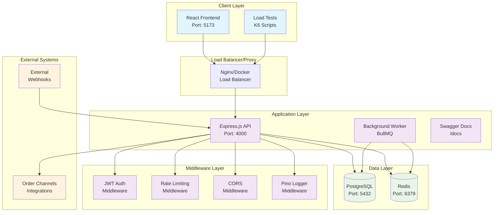

# System Overview Diagram

## High-Level Architecture

## Component Description

### Client Layer
- **React Frontend**: User interface built with React 19 and TypeScript
- **Load Tests**: K6 performance testing scripts for system validation

### Application Layer
- **Express.js API**: Main REST API server handling all business logic
- **Background Worker**: BullMQ worker for processing async jobs
- **Swagger Docs**: Auto-generated API documentation

### Middleware Layer
- **JWT Auth**: Token-based authentication system
- **Rate Limiting**: Protection against API abuse
- **CORS**: Cross-origin resource sharing configuration
- **Pino Logger**: Structured logging for monitoring

### Data Layer
- **PostgreSQL**: Primary database for persistent data storage
- **Redis**: Caching and job queue management

### External Systems
- **Webhooks**: Integration endpoints for external services
- **Order Channels**: Third-party order management integrations
