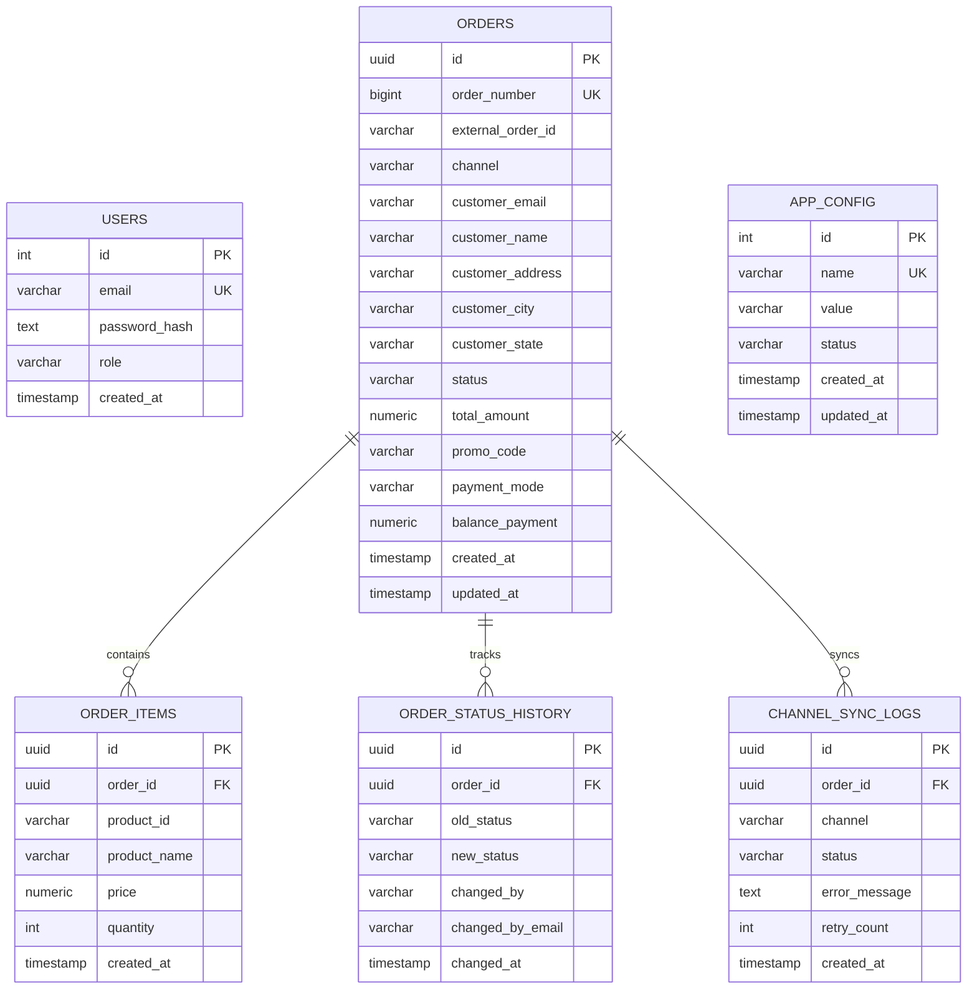

# Database Schema Diagram

## Entity Relationship Diagram

## Table Descriptions

### Core Tables

#### USERS
- **Purpose**: Store admin user accounts with authentication data
- **Key Fields**: 
  - `email`: Unique identifier for login
  - `password_hash`: Bcrypt hashed password
  - `role`: User permission level (SUPER_ADMIN)

#### ORDERS
- **Purpose**: Main order management table
- **Key Fields**:
  - `order_number`: Sequential order identifier
  - `external_order_id`: Reference to external system
  - `channel`: Source channel (e.g., website, mobile)
  - `status`: Current order status
  - `total_amount`: Order total value

#### ORDER_ITEMS
- **Purpose**: Individual products within an order
- **Relationship**: Many-to-one with ORDERS
- **Key Fields**:
  - `product_id`: External product reference
  - `price`: Item price at time of order
  - `quantity`: Number of items ordered

### Audit & Logging Tables

#### ORDER_STATUS_HISTORY
- **Purpose**: Track all status changes for compliance
- **Key Fields**:
  - `old_status` / `new_status`: Status transition
  - `changed_by`: User who made the change
  - `changed_at`: Timestamp of change

#### CHANNEL_SYNC_LOGS
- **Purpose**: Monitor external system synchronization
- **Key Fields**:
  - `channel`: External system name
  - `status`: Sync operation result
  - `error_message`: Failure details
  - `retry_count`: Number of retry attempts

### Configuration Table

#### APP_CONFIG
- **Purpose**: Store application configuration settings
- **Key Fields**:
  - `name`: Configuration key
  - `value`: Configuration value
  - `status`: Active/inactive state

## Indexes & Performance

### Primary Indexes
- `idx_orders_status`: Fast status-based queries
- `idx_orders_channel`: Channel-specific filtering
- `idx_orders_created_at`: Time-based sorting

### Unique Constraints
- `users.email`: Prevent duplicate accounts
- `orders.order_number`: Ensure unique order numbering
- `orders(external_order_id, channel)`: Prevent duplicate imports

## Data Integrity

### Foreign Key Relationships
- All child tables reference orders via `order_id`
- Cascade delete ensures data consistency
- Referential integrity maintained at database level

### Data Types
- UUIDs for distributed system compatibility
- Numeric precision for financial calculations
- Timestamps with timezone awareness
