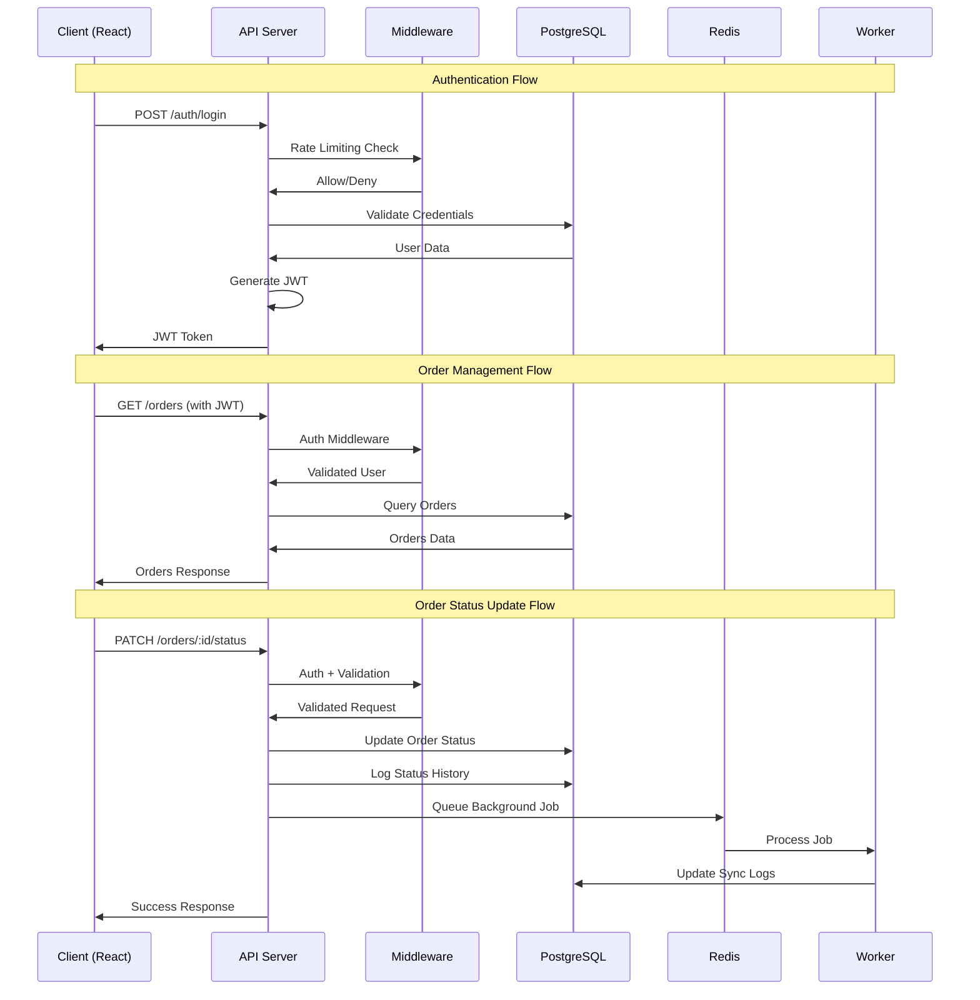
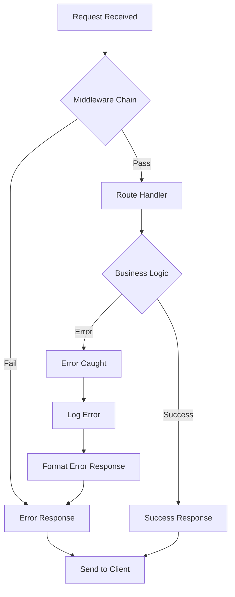

# API Flow Diagram

## Request-Response Flow

## API Endpoints Overview

### Authentication Endpoints
- `POST /auth/login` - User authentication
- `POST /auth/refresh` - Token refresh

### Order Management Endpoints
- `GET /orders` - List orders with pagination
- `GET /orders/:id` - Get specific order details
- `PATCH /orders/:id/status` - Update order status

### System Endpoints
- `GET /health` - System health check
- `GET /docs` - API documentation
- `POST /webhooks/*` - External webhook handlers

### Logs & Monitoring
- `GET /logs` - System logs access
- Internal logging via Pino middleware

## Middleware Chain

## Error Handling Flow

