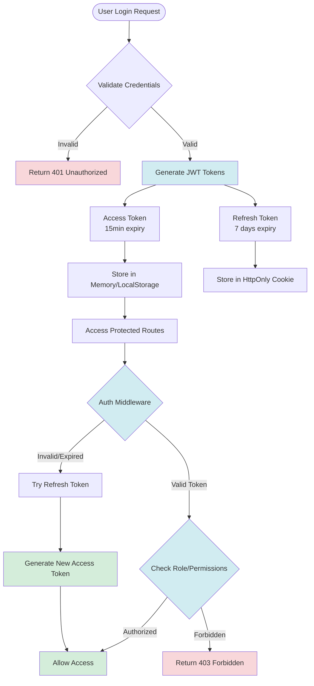
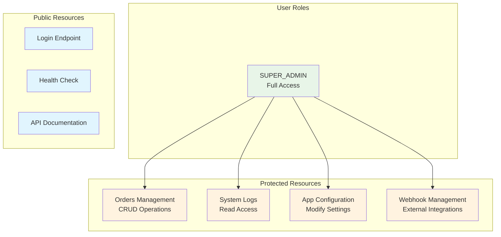
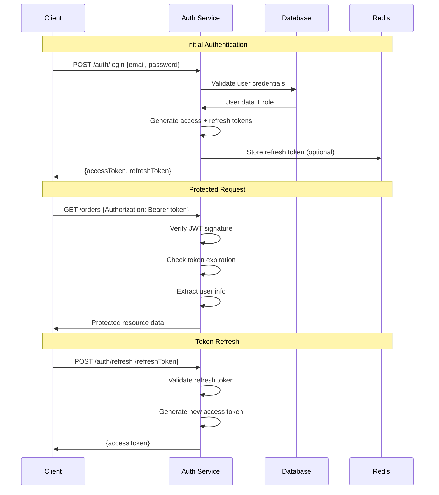

# Authentication & Authorization Flow

## JWT Authentication Flow

## Role-Based Access Control

## Token Lifecycle

## Security Measures

### Password Security
- **Bcrypt hashing**: Salted password storage
- **Rate limiting**: Login attempt protection
- **Strong password policy**: Enforced complexity

### Token Security
- **Short-lived access tokens**: 15-minute expiry
- **Refresh token rotation**: Enhanced security
- **Secure storage**: HttpOnly cookies for refresh tokens
- **JWT signing**: HMAC SHA-256 algorithm

### Session Management
- **Stateless design**: No server-side sessions
- **Token blacklisting**: Logout invalidation (via Redis)
- **Concurrent session limits**: Optional implementation

### Request Security
- **HTTPS enforcement**: Encrypted communication
- **CORS policy**: Restricted origins
- **Rate limiting**: Per-IP and per-user limits
- **Input validation**: Zod schema validation
