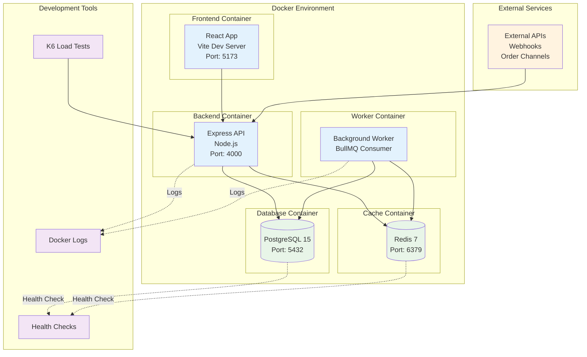
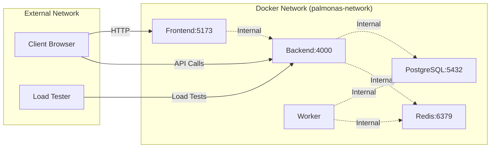
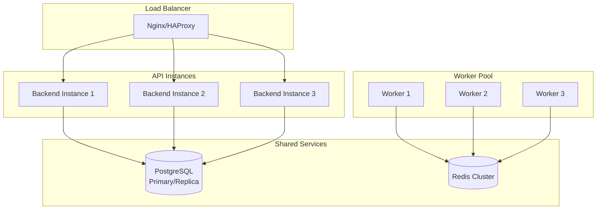

# Deployment Architecture

## Docker Container Architecture



## Container Details

### Frontend Container
- **Base Image**: Node.js Alpine
- **Build Tool**: Vite
- **Port**: 5173
- **Volume Mount**: Hot reload for development
- **Dependencies**: React, TypeScript, TailwindCSS

### Backend Container
- **Base Image**: Node.js Alpine
- **Runtime**: ts-node-dev for development
- **Port**: 4000
- **Volume Mount**: Source code for hot reload
- **Dependencies**: Express, PostgreSQL client, Redis client

### Worker Container
- **Base Image**: Same as backend
- **Process**: BullMQ worker
- **No Ports**: Internal processing only
- **Shared Codebase**: Uses backend source

### Database Container
- **Image**: PostgreSQL 15 Alpine
- **Port**: 5432
- **Volume**: Persistent data storage
- **Health Check**: pg_isready command

### Cache Container
- **Image**: Redis 7 Alpine
- **Port**: 6379
- **Health Check**: Redis ping command
- **Usage**: Session storage, job queues

## Network Architecture



## Environment Configuration

### Development Environment
```yaml
services:
  frontend:
    build: ./apps/frontend
    ports: ["5173:5173"]
    volumes: ["./apps/frontend:/app"]
    
  backend:
    build: ./apps/backend
    ports: ["4000:4000"]
    volumes: ["./apps/backend:/app"]
    command: npm run dev
    
  worker:
    build: ./apps/backend
    volumes: ["./apps/backend:/app"]
    command: npm run worker
```

### Production Considerations
- **Multi-stage builds**: Optimized image sizes
- **Health checks**: Container orchestration
- **Resource limits**: CPU and memory constraints
- **Secrets management**: Environment variable injection
- **Logging**: Centralized log aggregation

## Scaling Strategy

### Horizontal Scaling


## Monitoring & Observability

### Health Checks
- **Database**: Connection and query tests
- **Redis**: Ping and memory usage
- **API**: Response time and error rates
- **Worker**: Job processing metrics

### Logging Strategy
- **Structured logging**: JSON format with Pino
- **Log levels**: Debug, info, warn, error
- **Request tracing**: Unique request IDs
- **Performance metrics**: Response times, throughput

### Metrics Collection
- **Application metrics**: Custom business metrics
- **Infrastructure metrics**: CPU, memory, disk
- **Database metrics**: Connection pool, query performance
- **Queue metrics**: Job processing rates, failures
