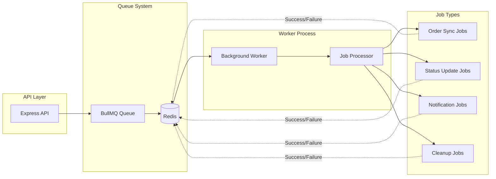
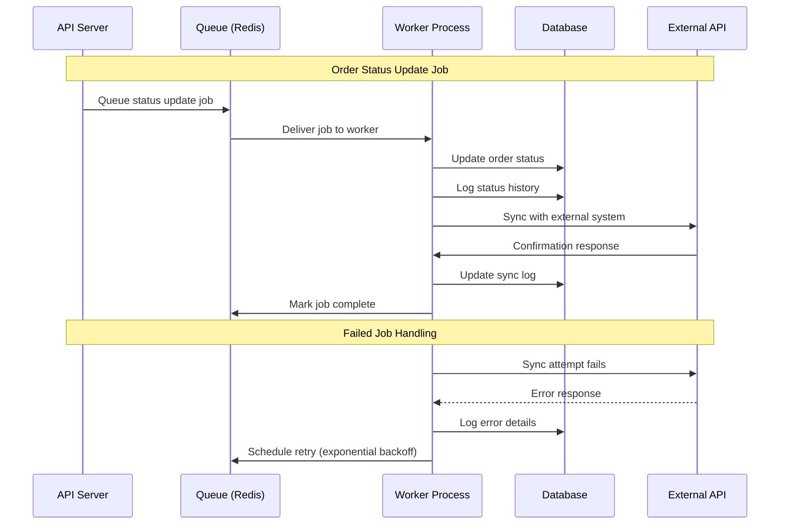
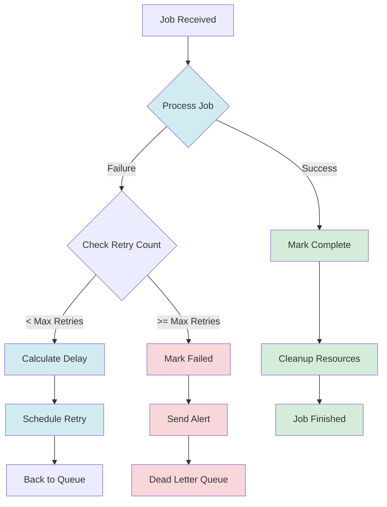

# Background Job Processing

## Job Queue Architecture



## Job Processing Flow



## Job Types & Responsibilities

### Order Synchronization Jobs
- **Purpose**: Keep external systems in sync with order changes
- **Trigger**: Order creation, status updates, cancellations
- **Retry Policy**: Exponential backoff, max 5 attempts
- **Data**: Order details, customer information, status changes

### Status Update Jobs
- **Purpose**: Process order status transitions
- **Trigger**: Manual status changes, webhook events
- **Processing**: Validate transitions, update database, notify systems
- **Logging**: Comprehensive audit trail

### Notification Jobs
- **Purpose**: Send customer and internal notifications
- **Types**: Email confirmations, SMS updates, internal alerts
- **Delivery**: Multiple channels with fallback options
- **Tracking**: Delivery status and bounce handling

### Cleanup Jobs
- **Purpose**: Maintain system health and performance
- **Schedule**: Periodic execution (daily/weekly)
- **Tasks**: Log rotation, expired token cleanup, cache maintenance
- **Monitoring**: Performance impact tracking

## Error Handling & Retry Strategy



## Queue Configuration

### Job Priorities
- **Critical**: System health, security alerts (Priority: 1)
- **High**: Order processing, customer notifications (Priority: 2)
- **Normal**: Status updates, sync operations (Priority: 3)
- **Low**: Cleanup tasks, analytics (Priority: 4)

### Concurrency Settings
- **Order Jobs**: 5 concurrent workers
- **Notification Jobs**: 10 concurrent workers
- **Cleanup Jobs**: 2 concurrent workers
- **Rate Limiting**: Per-external-API limits

### Retry Configuration
```javascript
const retryConfig = {
  attempts: 5,
  backoff: {
    type: 'exponential',
    delay: 2000, // 2 seconds initial delay
    multiplier: 2
  }
}
```

## Monitoring & Metrics

### Job Metrics
- **Processing Rate**: Jobs per minute/hour
- **Success Rate**: Percentage of successful jobs
- **Failure Rate**: Failed jobs by type and reason
- **Queue Depth**: Pending jobs count
- **Processing Time**: Average job duration

### Worker Health
- **Memory Usage**: Worker process memory consumption
- **CPU Usage**: Processing load metrics
- **Connection Health**: Database and Redis connectivity
- **Error Rates**: Exception frequency and types

### Queue Management
- **Dead Letter Queue**: Failed job analysis
- **Retry Statistics**: Retry attempt patterns
- **Peak Load Handling**: Queue performance under load
- **Resource Utilization**: Redis memory and CPU usage
