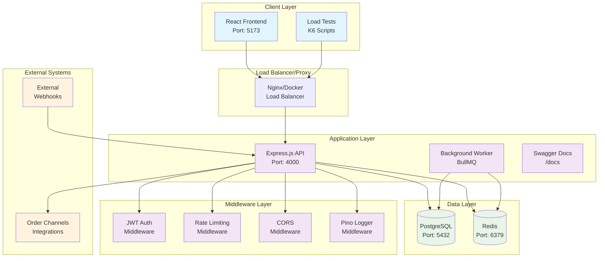
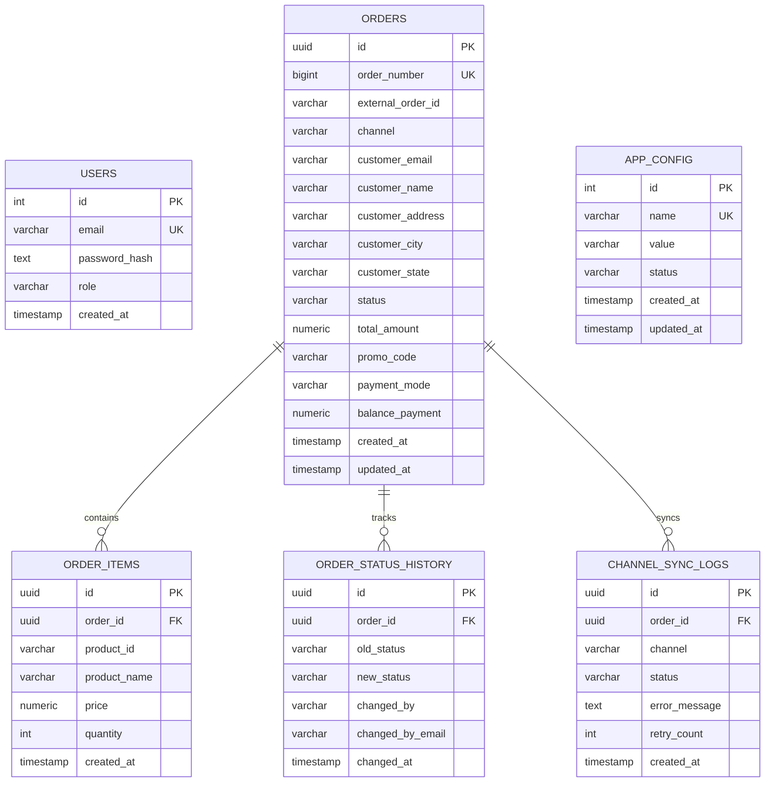
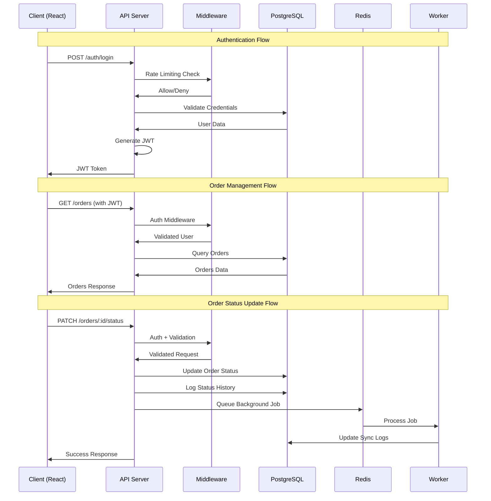
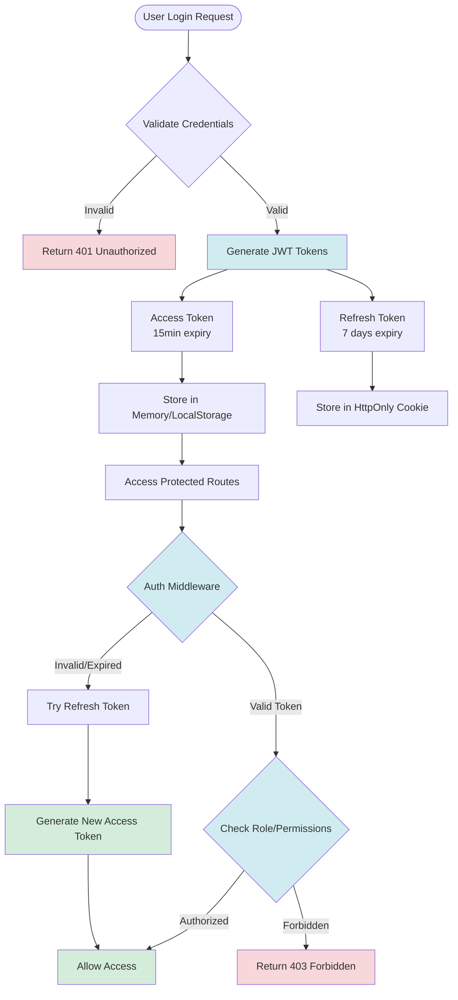
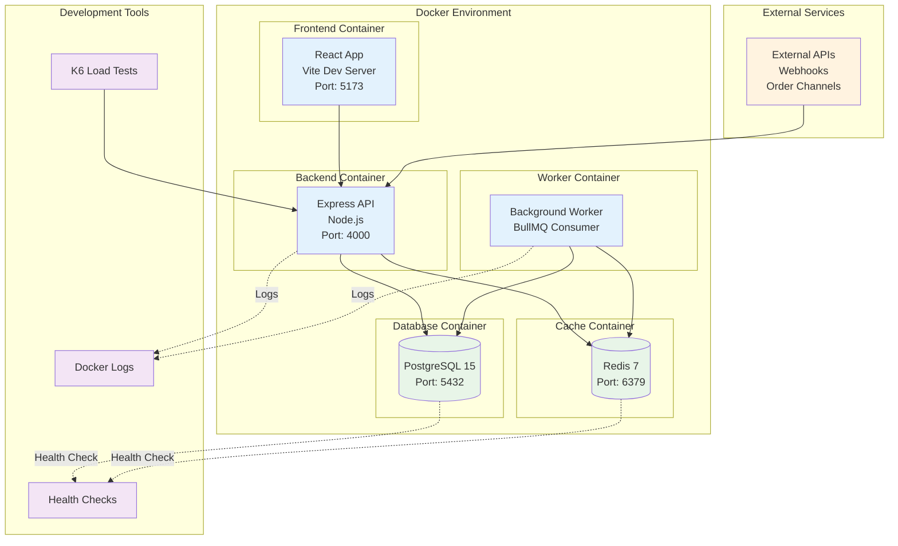
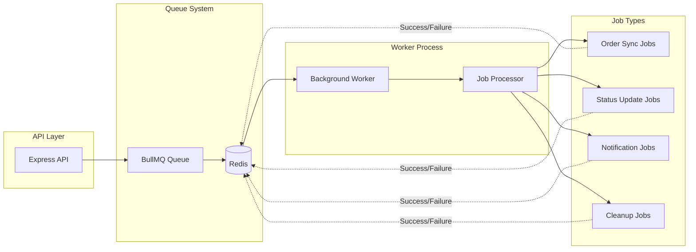
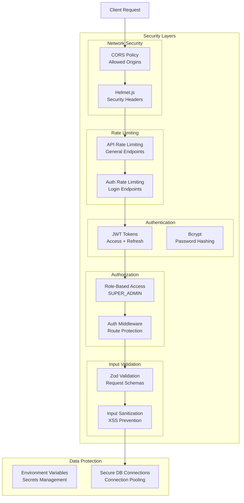

# Palmonas Admin CRM - System Design Diagrams

## 1. High-Level System Architecture

## 2. Database Schema Diagram

## 3. API Flow Diagram

## 4. Authentication & Authorization Flow

## 5. Deployment Architecture

## 6. Background Job Processing Flow

## 7. Security Architecture

## Architecture Decisions & Rationale

### Technology Choices
- **React + TypeScript**: Type safety and modern UI development
- **Express.js**: Lightweight, flexible Node.js framework
- **PostgreSQL**: ACID compliance for order data integrity
- **Redis**: Fast caching and job queue management
- **BullMQ**: Robust background job processing
- **Docker**: Consistent development and deployment environment

### Scalability Considerations
- **Horizontal scaling**: Stateless API design allows multiple instances
- **Database indexing**: Optimized queries for order lookups
- **Caching strategy**: Redis for frequently accessed data
- **Background processing**: Async job handling for heavy operations

### Security Measures
- **JWT authentication**: Stateless, scalable auth mechanism
- **Role-based access**: Granular permission control
- **Rate limiting**: Protection against abuse
- **Input validation**: Zod schemas prevent malicious input
- **Security headers**: Helmet.js for common vulnerabilities
