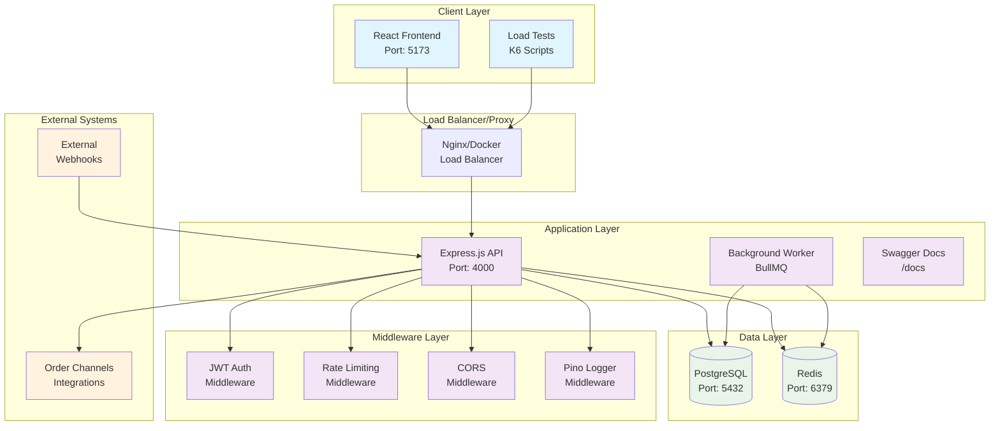
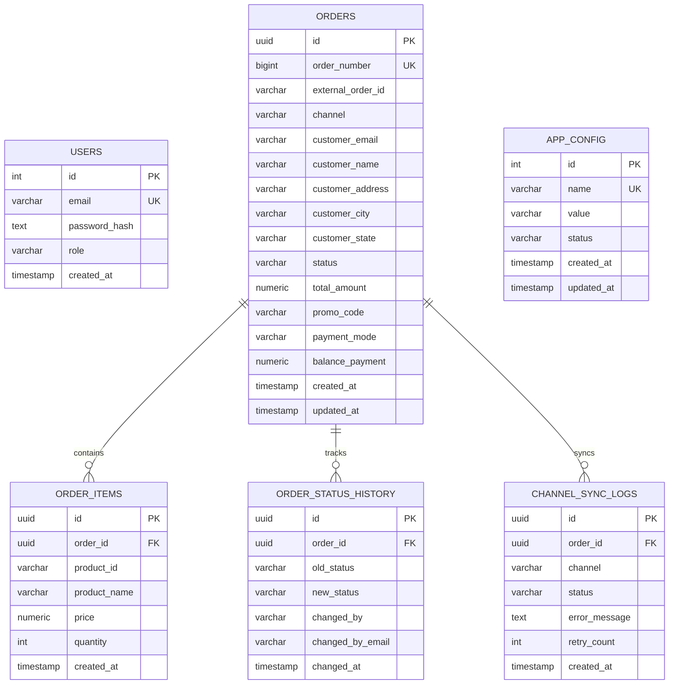
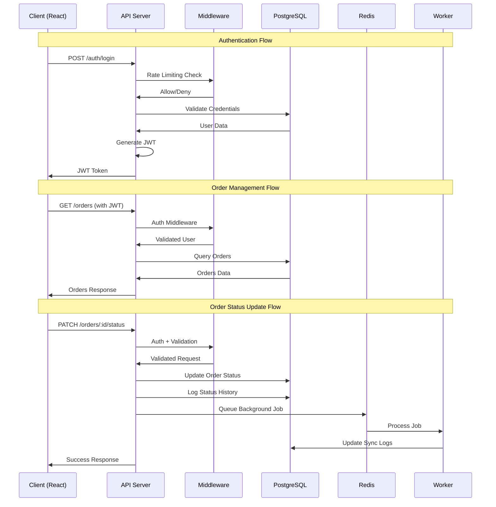
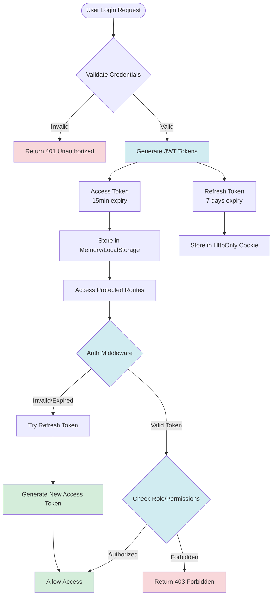

# Palmonas Admin CRM - System Design Diagrams

## 1. High-Level System Architecture

## 2. Database Schema Diagram

## 3. API Flow Diagram

## 4. Authentication & Authorization Flow

## 📊 Architecture Highlights

### Scalability Features
- **Stateless API design** for horizontal scaling
- **Background job processing** for async operations
- **Redis caching** for performance optimization
- **Database indexing** for query performance

### Security Measures
- **JWT authentication** with refresh token rotation
- **Role-based access control** (RBAC)
- **Rate limiting** and request validation
- **Secure password hashing** with bcrypt

### Reliability Features
- **Health checks** for all services
- **Structured logging** with request tracing
- **Error handling** with retry mechanisms
- **Database transactions** for data consistency
